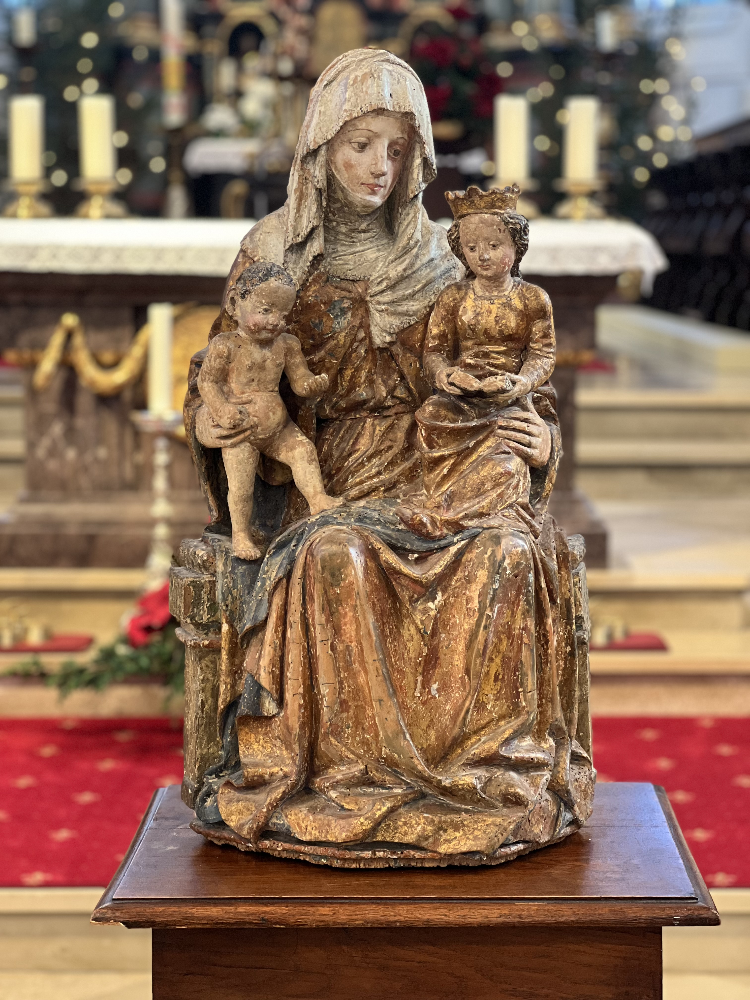
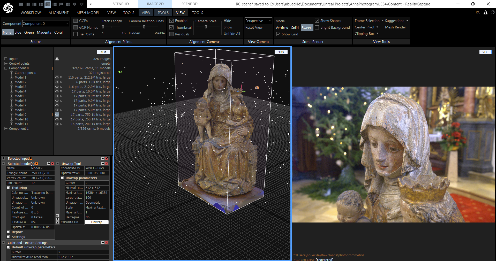

# Photogrammetry Files and Workflow Documentation
**Author**: Andreas Bueckle ([https://andreas-bueckle.com/](https://andreas-bueckle.com/))\
**Date**: December 29, 2024

## Overview
In this project, a wooden sculpture depicting [Virgin and Child with Saint Anne](https://en.wikipedia.org/wiki/Virgin_and_Child_with_Saint_Anne) was photogrammetrized. The 15th century art piece was stolen in 1973 and resurfaced in 2024, then returned to its original place in St. Cyriacus in Wiesensteig, Germany ([website in German](https://www.wiesensteig.de/startseite)). A news article is [available in German](https://www.swr.de/swraktuell/baden-wuerttemberg/stuttgart/wiesensteig-diebstahl-figur-kirche-lka-100.html). A more detailed video is [available in German](https://filstalwelle.de/video/2024-11-26-wiesensteig-gestohle-kirchenfigur-anna-selbdritt-kehrt-nach-51-jahren-in-die-stiftskirche-zurueck).

## Result

<model-viewer 
  src="https://andreasbueckle.github.io/photogrammetry-sculpture/models/anna_lod_2.glb" 
  alt="LOD 2 model of the sculpture" 
  auto-rotate 
  camera-controls 
  style="width: 100%; height: 500px;">
</model-viewer>

**Figure 1**. This LOD 2 model of the St. Anna sculpture features ~200,000 polygons and is ~7.5 MB large.

Please contact Andreas Bueckle (<a href="mailto:abueckle@iu.edu">abueckle@iu.edu</a>) for access to the models, including the LOD 0 one.

## Workflow
The following steps were taken: 

1. The sculpture was placed onto a wooden table in a large, naturally lit space.    

**Figure 2**. The sculpture sitting on a table, ready for taking photographs.

2. 326 raw images in the RAF format were taken with a Fujifilm mirrorless camera and a 23mm lens (see **Hardware** below). 
3. All 326 images were imported into Reality Capture (see **Software** below) and a 3D model was computed in ~5 hours on a laptop running Windows 11, 64 GB RAM, and a Nvidia A2000 GPU.

**Figure 3**. A screenshot of Reality Capture, including the 3D view (left) and a view of one of the images used to construct the model (right).

4. The final model was textured and exported using the official tutorial at [https://www.youtube.com/watch?v=kRD0rgCnOWQ](https://www.youtube.com/watch?v=kRD0rgCnOWQ).
5. The original model from 326 photos has 212 million polygons and was not exported. 
6. For the LOD 0 export (highest resolution), the export out of Reality Capture was used (10 million polygons). 
7. For the LOD 1 export (lower resolution), the model was imported into Blender to combine mesh and textures  resized in Photoshop.
8. For the LOD 2 export (lowest resolution, see **Figure 1**), the model was again imported into Blender to combine mesh and textures  resized in Photoshop.

## Software 
- [Reality Capture](https://www.capturingreality.com/)
- [Blender 4.3.2](https://www.blender.org/)

## Hardware
- [Fujifilm XT3](https://fujifilm-dsc.com/en/manual/x-t3/)
- [Fujifilm XF 23mm F2 WR](https://fujifilm-x.com/global/products/lenses/xf23mmf2-r-wr/)